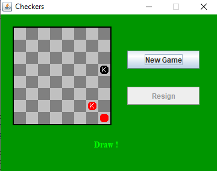

# AI-Checkers
This is a project that demonstrates how a minimax algorithm can be used in checkers. It also uses alpha-beta pruning to decrease the amount of options by removing moves when they are determined to be worse than any other move. I used a checkers GUI sourced from http://math.hws.edu/eck/cs124/javanotes6/source/Checkers.java and modified it to include the AI algorithms needed.
## User vs AI
If you want to try to beat the AI or test it out you can run the Java project (I used Eclipse when making it) from the Checkers.java file and use the GUI that pops up.

You can change the difficulty of the AI by increasing or decreasing the number of levels of minimax the algorithm uses. This is the final parameter of the `makeDecision` method shown in the image below.

## AI vs AI
If you want to see which of two AI players will win you can comment out `line 474` and uncomment `line 475` as shown in the image below. 

To have the two AIs play against each other you must click a checker on the red side of the board and wait to see the results of the match.

You can change how many levels of minimax the AI uses by changing the third parameter of the makeDecision method to be lower or higher. Varying the two levels generally makes it easier to see one AI actually win instead of resulting as a draw. Changing the difficulty is the same as in the User vs AI section and is shown below. The red AI level is the top one and the black is the bottom one.

